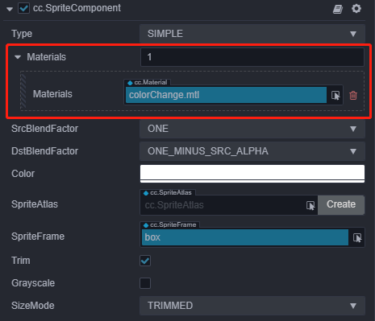

# UI Custom Material
We supports UI custom material in sprite component since v1.2, the user interface is as follows:



其使用方法与其他材质并无不同，但由于 SpriteComponent 面板有基于 UI 内置材质的功能，所以有一些需要注意的点：
Its usage is no different from other materials, but because the SpriteComponent has some function based on the UI-built-in materials, there are some points to note:

- When the number of custom materials is set to 0 or empty, the default material will be used. Please refer to [SpriteComponent](../editor/sprite.md)
- UI does not support multiple materials, the number of custom materials is at most one
- When the ui custom material is used, the Grayscale function on the panel will be invalid. Users can choose to implement this function in the material
- After setting the custom material, the Color property on the panel will be mixed with the color set in the material itself (if had) to affect the rendering color of the sprite
- For custom materials, you need to introduce the cc-sprite-texture header file in the shader and sample the cc_spriteTexture, you can directly set the image resources used by the sprite through the SpriteFrame on the settings panel
- For example, a simple fragment shader that uses the panel setting SpriteFrame to sample textures should look like the following:
    ```
    CCProgram sprite-fs %{
        precision highp float;
        #include <embedded-alpha>
        #include <cc-sprite-texture> // Introduce preset header files

        in vec4 color;
        in vec2 uv0;
        
        uniform Constant {
            vec4 mainColor;
        };
        
        vec4 frag () {
            vec4 o = vec4(1, 1, 1, 1);
            o *= texture(cc_spriteTexture, uv0); // sample cc_spriteTexture
            o *= color;
            o *= mainColor;
            return o;
        }
    }%
    ```
- If users want to perform uniform assignment operations to custom materials, they can operate by obtaining the material on the SpriteComponent. We provide different interfaces to deal with different operating conditions, as shown in the following code: **(Please pay attention to the difference Notes on the interface!)**
    ```ts
        let spriteCom = this.node.getComponent(SpriteComponent);
        // What is obtained through the sharedMaterial method is a shared material resource, and operations on material will affect all rendering objects that use this material
        let material = spriteCom.sharedMaterial;

        // The material trial used by the current rendering component obtained through the material method, the operation for material Instance will only affect the current component
        let materialInstance = spriteCom.material;

    ```


